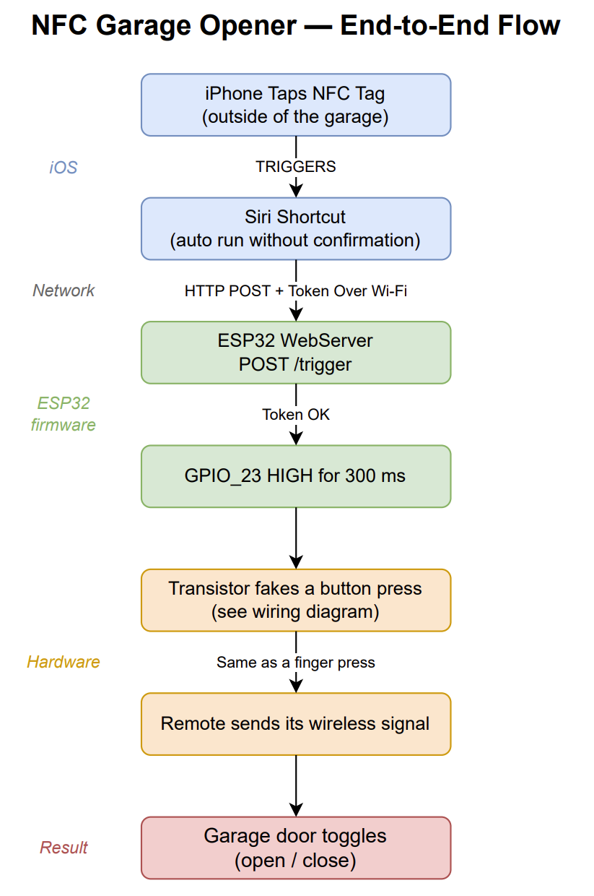
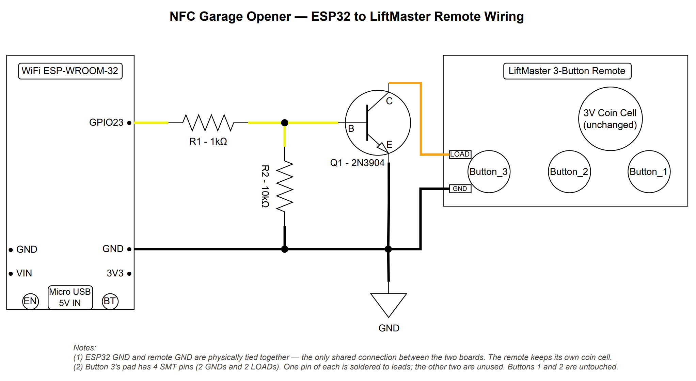

# nfc-garage-opener
ESP32-based local garage controller using NFC-triggered iPhone Shortcuts and an official LiftMaster rolling-code remote.

## Overview
This project creates a simple and reliable garage door control system using:
- iPhone NFC automations
- ESP32 Wi-Fi microcontroller
- HTTP-based local network control
- LiftMaster rolling-code remote emulation

Instead of interfacing directly with the garage opener hardware, the ESP32 electronically triggers an official LiftMaster remote. This preserves compatibility and rolling-code RF security while avoiding opener modification or cloud APIs.

## Features
- NFC-triggered garage control
- Local network only (no cloud dependency)
- Uses official LiftMaster remote
- No garage opener wiring changes
- Simple HTTP API
- Token-authenticated trigger requests
- Cooldown protection against repeated triggers
- mDNS support
- Minimal hardware design

## System Architecture
- iPhone taps NFC tag
- Triggers Siri Shortcut
- HTTP POST request
- ESP32 verifies token
- ESP32 triggers GPIO23
- Transistor fakes a button press
- Remote sends toggle signal
- Garage door opens/closes
### See [System Flow Diagram PDF](system_flow_diagram.pdf)

## Hardware
### Components
- ESP32 ESP-WROOM-32 development board
- LiftMaster 893LM remote
- 2N3904 NPN transistor
- 1kΩ resistor
- 10kΩ pulldown resistor
- Breadboard (for testing)
- Micro-USB power
### Wiring Notes
- ESP32 and remote share GND only
- Remote retains its own coin-cell battery
- Transistor momentarily shorts the remote button contacts
- GPIO23 is used as the trigger output
### See [Wiring Diagram PDF](wiring_diagram.pdf)

## Software
### Arduino IDE 
- Code developed and deployed with Arduino IDE 
### ESP32 Firmware
- The ESP32 hosts a lightweight HTTP server exposing:
  - POST /trigger 
  - GET /status
- POST request must include:
  - X-Auth-Token: YOUR_TOKEN
### iPhone Shortcut
- An iPhone NFC automation performs:
  - NFC tag tap
  - HTTP POST to ESP32 (via local Wi-Fi)
- The shortcut runs automatically as long as iPhone is unlocked.

## Security Considerations
### This project intentionally:
- avoids cloud services
- avoids exposing the device to the public internet
- preserves LiftMaster rolling-code authentication
- uses token-based request authentication
- requires physical NFC interaction for normal use

## Disclaimer
This project is intended for educational and personal-use purposes only. Safety first and DIY at your own risk.
